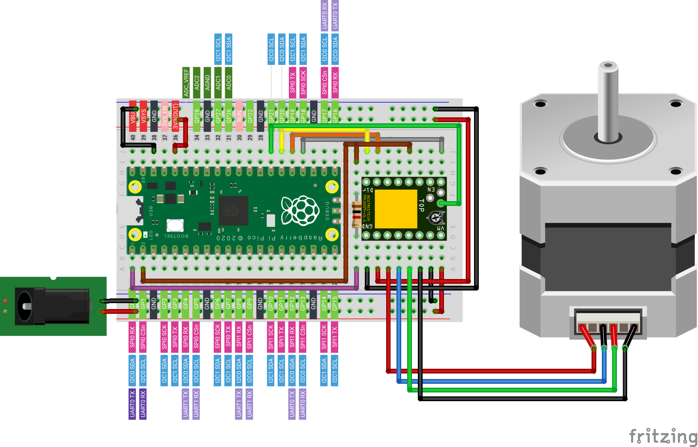
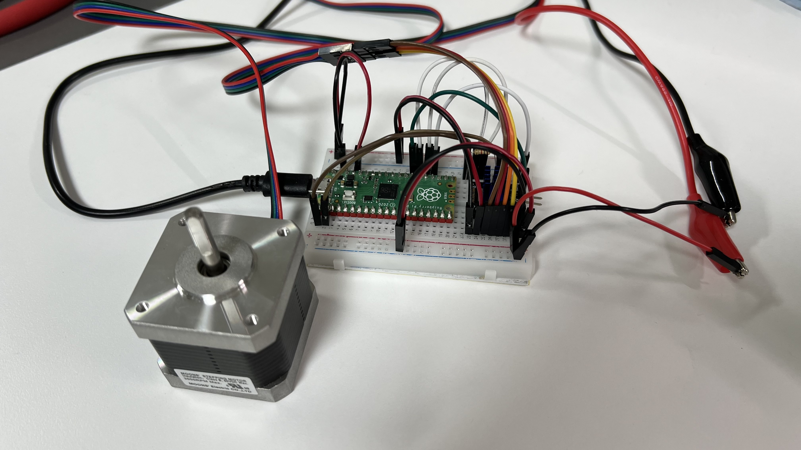

# TMC_2209_Raspberry_Pi_Pico
MicroPython 1.17 라즈베리파이 피코를 위한 TMC2209 라이브러리입니다.

[Christain/TMC2209_Raspberry_Pi](https://github.com/Chr157i4n/TMC2209_Raspberry_Pi) 의 소스코드를 기반으로 MicroPython 피코에서 작동하도록 일부 함수를 수정하였습니다. 원본 코드 및 수정된 본 소스코드는 모두 테스트 상태이며, 정상적으로 작동하지 않을 수 있습니다.

## 테스트 환경
Raspberry Pi Pico: https://slt.pw/cb7VTsi

BTT TMC2209 V1.2: https://slt.pw/n2pw9ja

## 결선

## test_script_01_uart_connection.py
UART의 연결 상태를 확인합니다. 통신이 올바르게 진행된다면 "TMC2209: after 10 tries not valid answer. exiting"을 출력합니다.

## test_script_02_pin_connection.py
모터드라이버와 통신하여 핀의 연결상태를 확인합니다. 올바르게 결선되었다면 "Pin DIR: OK Pin STEP: OK Pin EN: OK" 메시지가 출력됩니다.

## test_script_03_basic_movement.py
정방향 작동, 역방향 작동을 3회 반복합니다.

## test_script_04_stallguard.py
TMC2209의 StallGuard 기능을 테스트합니다. 모터가 10회 회전하며, 회전 중 탈조가 발생하면 "StallGuard!" 문구가 출력되며 작동을 멈춥니다. 만약 문제 없이 작동이 완료되었다면 "Movement finished successfully" 문구가 출력됩니다.
